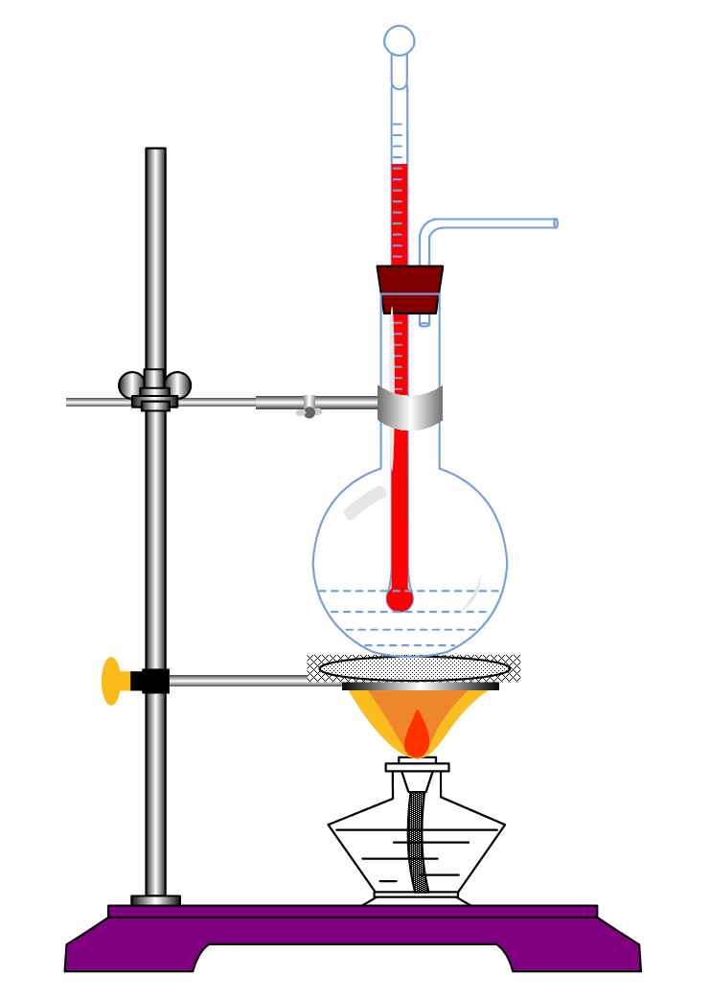

+++
date = '2026-08-19T23:37:15+08:00'
draft = false
math = true
title = '实验探究：测量酒精灯的热效率'
tags = ["物理", "初中", "实验"]
+++

> 本实验非教材实验，过程难免缺乏严谨性，仅供参考

## 实验目的

测量酒精灯的热效率

## 实验原理

$$ \eta = \dfrac{Q_\text{有用}}{Q_\text{总}} \times 100\% $$

## 实验器材

酒精灯、陶土网、圆底烧瓶、量筒、胶头滴管、托盘天平与砝码、温度计、秒表、铁架台

## 实验思路

* 已知水的比热容 $c_\text{水}$，用酒精灯加热圆底烧瓶中的水，通过测定一段时间内水温度的变化量 $\Delta T$，计算水吸收的热量
* 已知酒精的热值 $q_\text{酒精}$，用天平称量实验前后酒精质量的变换量 $\Delta m$，进而计算酒精燃烧放出的热量

## 实验过程

* 用量筒和**胶头滴管**量取体积为 $V$ 的水，并倾倒入圆底烧瓶中
* **由下至上**组装器材，**点燃酒精灯**并调节陶土网高度，使酒精灯**外焰**加热陶土网，温度计测温泡**浸入**水中，且**不触碰容器底或容器壁**。称量此时酒精灯的质量为 $m_1$，记录此时温度计的示数为 $T_1$
* 点燃酒精灯，使酒精灯加热容器中的水，观察到温度计示数上升；当温度计的示数为**合适的**选定温度值 $T_2$（$T_1 < T_2 < 100^{\circ}\mathrm{C}, T_2 - T_1 \ge 20^{\circ}\mathrm{C}$）时，停止加热，**撤走并盖灭**酒精灯。称量此时酒精灯的质量为 $m_2$
* 计算得酒精灯的热效率 
  $$ \eta = \dfrac{c_\text{水}\rho_\text{水}V(T_2 - T_1)}{q_\text{酒精}(m_1 - m_2)} \times 100\%$$
* **重复实验**

    

## 数据处理

| 实验次数 | 水体积 $V$ / m³ | 初始质量 $m_1$ / kg | 初始温度 $T_1$ / ℃ | 末质量 $m_2$ / kg | 末温度 $T_2$ / ℃ | 热效率 $\eta$ |
| :---: | :---: | :---: | :---: | :---: | :---: | :---: |
| 1 |
| 2 |
| 3 |

## 误差分析

* 酒精灯火焰的热量只有一部分被水吸收，很大一部分散失到空气中了，因而会使测得的热效率偏小
* 陶土网吸收了一部分热量，导致测得的热效率偏小
* 酒精燃烧不完全，放出热量偏小，导致测得的热效率偏小

## 改进实验

* 可使用试管代替圆底烧瓶，防止陶土网吸热
* 可使用玻璃棒搅拌液体，使水受热均匀
* 可使用温度传感器更精准地测量温度差

## 实验结论
酒精灯的热效率一般在 $10\%$ 到 $30\%$ 之间

---