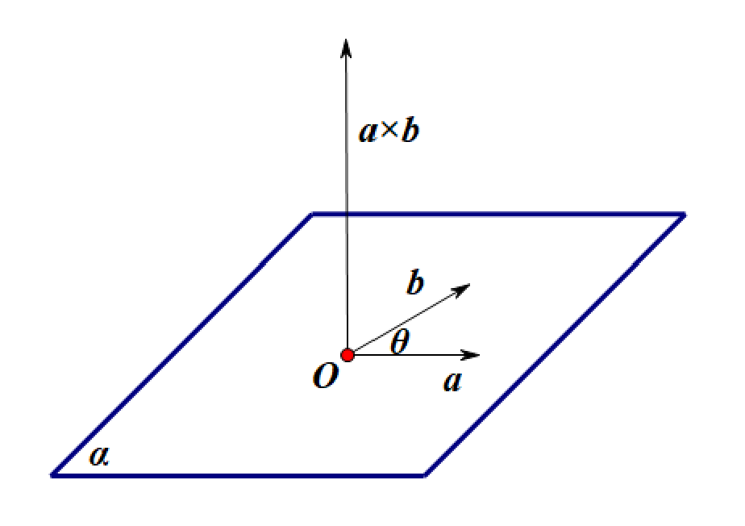
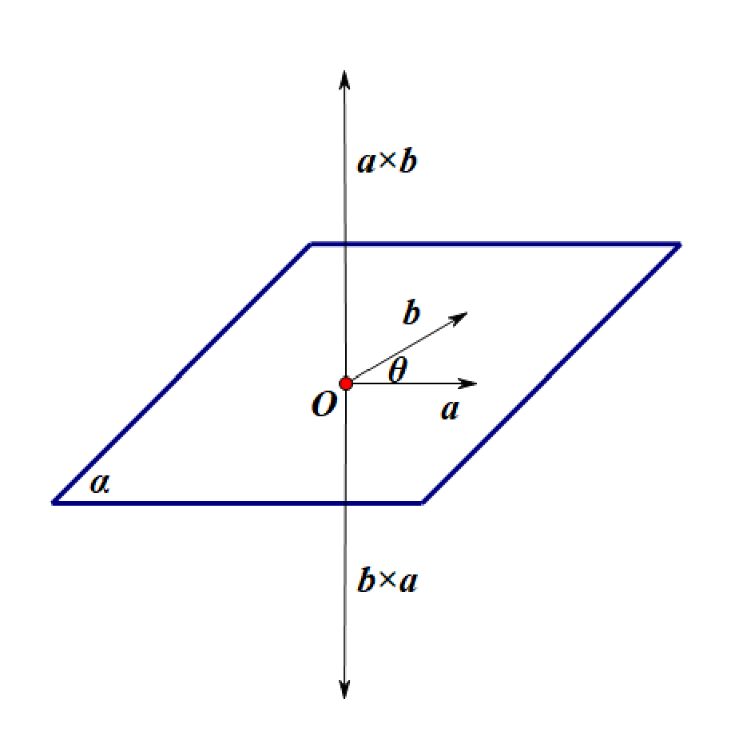
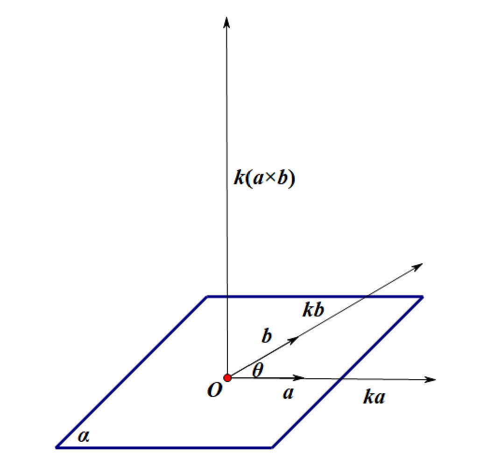
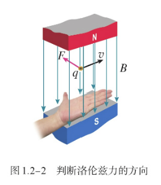
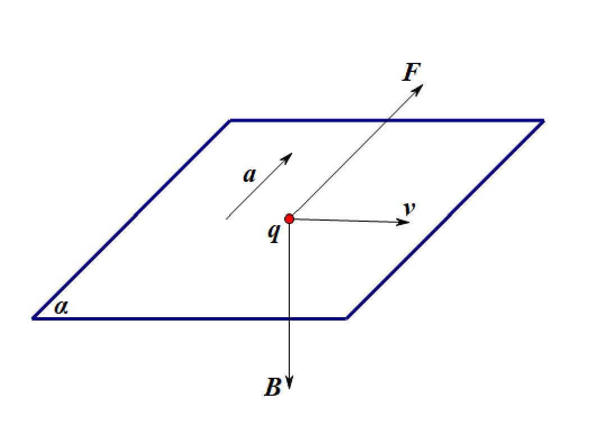
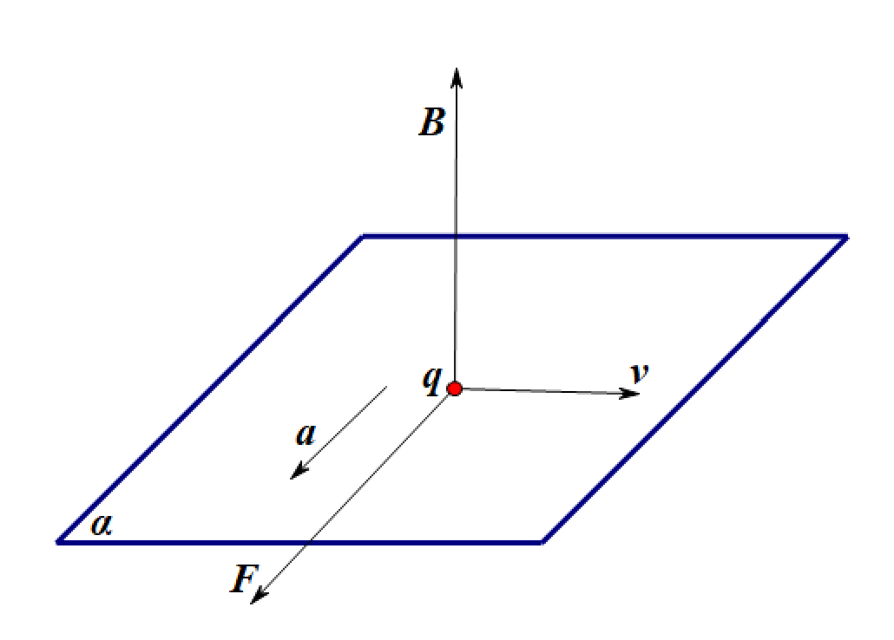
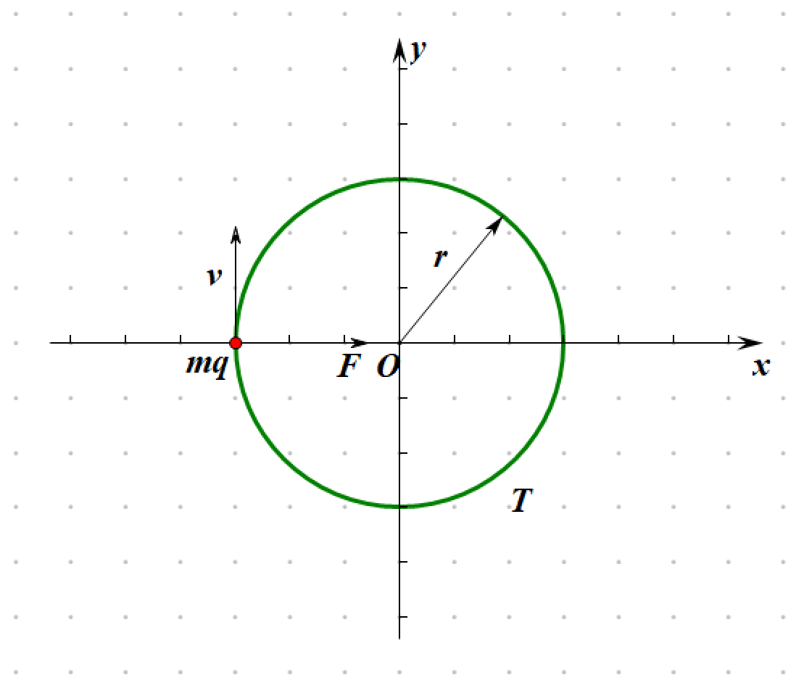

+++
date = '2026-08-20T15:08:44+08:00'
draft = false
math = true
title = '从向量叉乘理解左手定则'
tags = ["数学", "物理", "高中", "大学"]
+++

## 向量叉乘

向量有两种乘法：**点乘**与**叉乘**

对平面 $\alpha$ 上两向量 $\bm{a}$、$\bm{b}$，有

$$ \bm{a} \cdot \bm{b} = |\bm{a}| \cdot |\bm{b}| \cdot \cos\theta $$
$$ |\bm{a} \times \bm{b}| = |\bm{a}| \cdot |\bm{b}| \cdot \sin \theta $$

其中 $\bm{a} \cdot \bm{b}$ 为标量，$\bm{a} \times \bm{b}$ 为向量，方向由右手螺旋定则确定，且垂直于 $\bm{a}$、$\bm{b}$

    

向量叉乘具备如下性质：

$$ \bm{a} \times \bm{b} = -\bm{b} \times \bm{a} $$

    

$$ k\bm{a} \times \bm{b} = \bm{a} \times k\bm{b} = k(\bm{a} \times \bm{b}) $$

    

实际上，高中教材中的公式并未完全采用矢量写法，矢量点乘与叉乘也未作区分

高中教材中的点乘公式举例：

$$ W = \bm{F} \cdot \bm{s} = Fs\cos\theta $$
$$ P = \bm{F} \cdot \bm{v} = Fv\cos\theta $$
$$ \Phi = \bm{B} \cdot \bm{S} = BS\cos\theta $$

高中教材中的叉乘公式举例：

$$ \bm{v} = \bm{\omega} \times \bm{r} $$
$$ \bm{F} = I\bm{l} \times \bm{B} $$
$$ \bm{F} = q\bm{v} \times \bm{B} $$
$$ \bm{M} = \bm{r} \times \bm{F} $$

## 左手定则

高中教材对左手定则的描述如下：

> **伸开左手，使拇指与其余四个手指垂直，并且都与手掌在同一个平面内；让磁感线从掌心垂直进入，并使四指指向电流的方向，这时拇指所指的方向就是运动的正电荷在磁场中所受洛伦兹力的方向**

    

理论分析可得到带电粒子在纸入磁场中所受洛伦兹力的方向为**相对带电粒子运动方向垂直向左**

    

同样地，带电粒子在纸出磁场中所受洛伦兹力的方向为**相对带电粒子运动方向垂直向右**

    

进而可判断带电粒子在匀强磁场中作**匀速圆周运动**，受到恒垂直于速度方向的洛伦兹力

$$ F = qvB\sin\theta = qvB\sin\dfrac{\pi}{2} = qvB $$

洛伦兹力作向心力，由 $F_n = m\dfrac{v^2}{r}$ 得，

$$ m\dfrac{v^2}{r} = qvB $$
$$ r = \dfrac{mv}{qB} $$
$$ v = \dfrac{qrB}{m}$$

由 $v = \omega r$ 得，

$$ \omega = \dfrac{v}{r} = \dfrac{\dfrac{qrB}{m}}{r} = \dfrac{qB}{m} $$

由 $T = \dfrac{2\pi}{\omega}$ 得，

$$ T = \dfrac{2\pi}{\dfrac{qB}{m}} = \dfrac{2\pi m}{qB} $$

进而得到带电粒子在匀强磁场中作匀速圆周运动的半径与周期：

$$ r = \dfrac{mv}{qB} $$
$$ T = \dfrac{2\pi m}{qB} $$

$\square$

    

