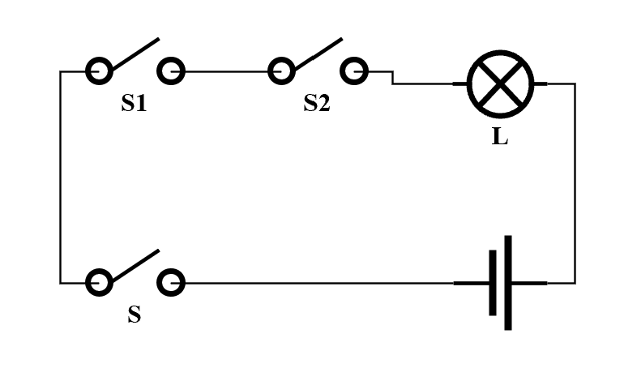
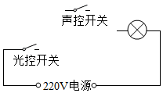
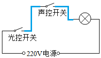
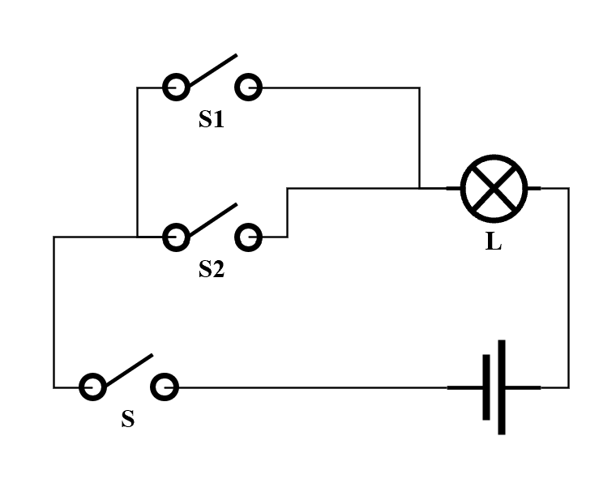
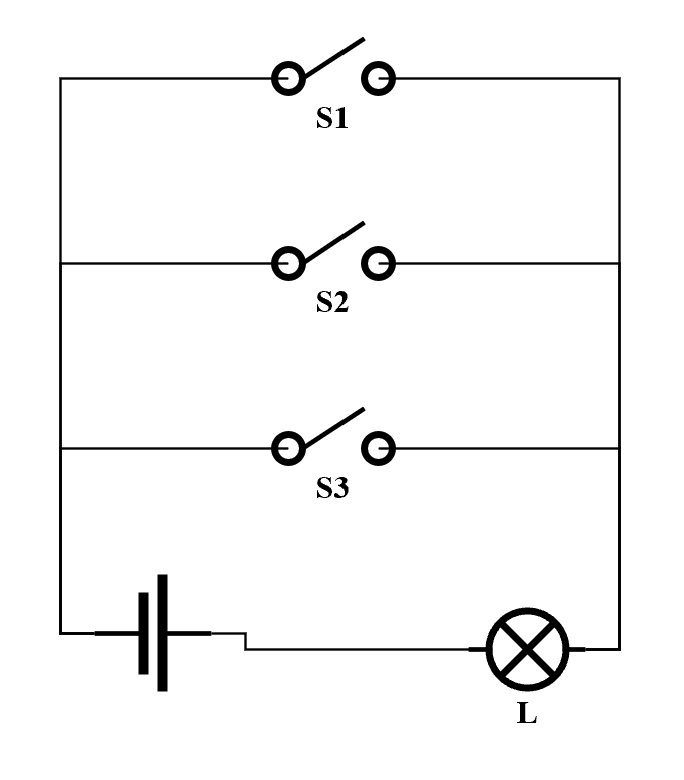
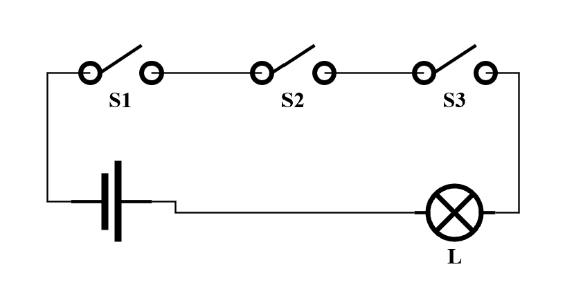
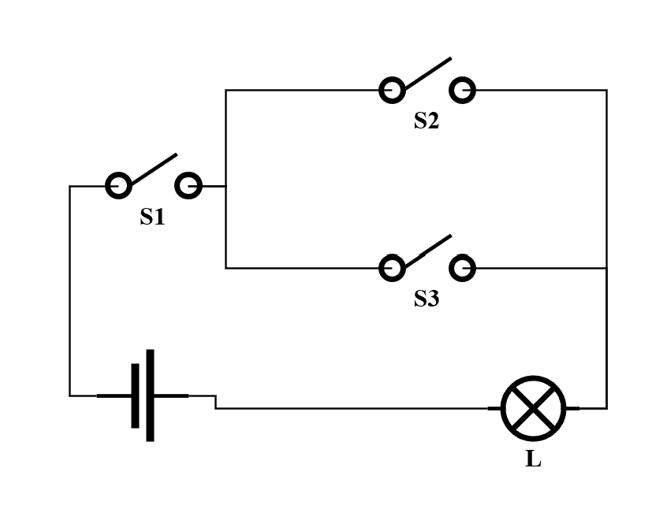
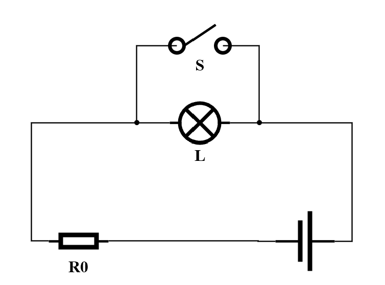
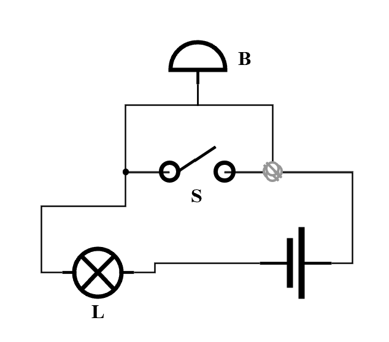
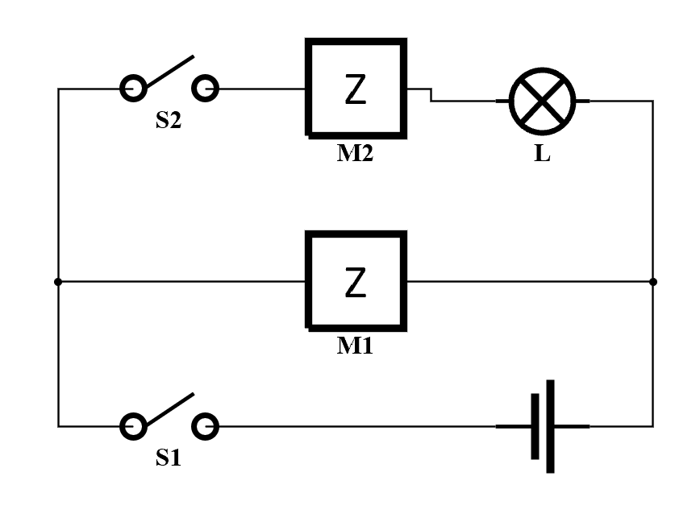

+++
date = '2026-08-22T20:00:00+08:00'
draft = false
math = true
title = '电路设计中的逻辑电路'
tags = ["物理", "初中"]
+++

## 与门（AND）

通过**串联**两开关与用电器实现与门

$$ \ce{S1 \& S2 -> L} $$

| S1 | S2 | L | 表达式 |
| :---: | :---: | :---: | :---: |
| ON | ON | ON | $\ce{S1^{ON} \& S2^{ON} -> L^{ON}}$ |
| ON | OFF | OFF | $\ce{S1^{ON} \& S2^{OFF} -> L^{OFF}}$ |
| OFF | ON | OFF | $\ce{S1^{OFF} \& S2^{ON} -> L^{OFF}}$ |
| OFF | OFF | OFF | $\ce{S1^{OFF} \& S2^{OFF} -> L^{OFF}}$ |

    

> **【例1】** 为节省电能，楼道中的照明灯只有同时满足“天黑和有人路过楼道有声音”时，才会自动亮。为满足用户要求，小强设计出了楼道照明灯的“智能控制电路”控制电路由“光控开关”（天黑就闭合，天亮亮就断开）和“声控开关”（有人走过有声音就闭合，没有声音一段时间后断开）组成，在答题卡上完成电路的连接。

    

**【解答】** 根据题意可判断此为与门（AND），连接如下图

    

## 或门（OR）

通过**并联**两开关，再与用电器串联实现或门

$$ \ce{S1 / S2 -> L} $$

| S1 | S2 | L | 表达式 |
| :---: | :---: | :---: | :---: |
| ON | ON | ON | $\ce{S1^{ON} / S2^{ON} -> L^{ON}}$ |
| ON | OFF | ON | $\ce{S1^{ON} / S2^{OFF} -> L^{ON}}$ |
| OFF | ON | ON | $\ce{S1^{OFF} / S2^{ON} -> L^{ON}}$ |
| OFF | OFF | OFF | $\ce{S1^{OFF} / S2^{OFF} -> L^{OFF}}$ |

    

> **【例2】** 小明一家是美满的三口之家。为了倡导民主的家庭生活，想采用投票的方式决定假期是否外出旅游。小明、爸爸和妈妈分别设计一个家庭决策表决器。现给你1只灯泡，2节干电池，3个开关，导线若干，请你设计符合上述要求的电路图。  
> **（1）** 爸爸设计的原理是：3个开关控制一盏灯的亮灭。只要一人赞成，闭合所负责的开关，灯就亮。灯亮表示提议决策通过。  
> **（2）** 妈妈设计的是“一票否决器”，只要一人否决，断开所负责的开关，灯就不亮。  
> **（3）** 小明设计的原理是：如果父母至少一人同意，同时自己也要去的话，他们就决定去旅游。三人各自控制一只开关（闭合表示同意，断开表示不同意），表决后只要灯亮就决定去旅游 （请在开关旁注明控制开关的人）。  

**【解答】** **（1）** 根据题目描述可判断题目要求为

$$ \ce{S1 / S2 / S3 -> L} $$

进而设计出如下图所示电路图

    

**（2）** 根据题目描述可判断题目要求为

$$ \ce{S1 \& S2 \& S3 -> L} $$

进而设计出如下图所示电路图

    

**（3）** 该小问较为复杂，涉及到混联电路，题目要求为

$$ \ce{S1 \& (S2 / S3) -> L} $$

进而设计出如下图所示电路图

    

## 非门（NOT）

通过**短接**用电器实现非门（**需加装安全电阻**）

$$ \ce{!S -> L} $$

| S | L | 表达式 |
| :---: | :---: | :---: |
| ON | OFF | $\ce{!S^{ON} -> L^{OFF}}$ |
| OFF | ON | $\ce{!S^{OFF} -> L^{ON}}$ |

    

> **【例3】** 某牧场中花木相间，景色宜人，为了防止羊圈中的羊丢失，现在牧场主想利用节能小灯泡、电铃、电池组、开关各一个，以及足够长的细导线，设计一个值班人员在值班室看护报警器，要求：正常情况下，值班室内灯亮铃不响，有羊冲出羊圈时，碰到栅栏后会拉断细导线，此时灯亮电铃响。请在下面画出你设计的电路图。

**【解答】** 分析题目可得此题目为对电铃的非门电路，即

$$ \ce{!S -> B}$$

进而设计出如下图所示电路图

    

下面提供一道电路设计题供选做

> **【例4】** 瑞瑞同学有一辆黑猫警长玩具电动车，车内的电路中有4节干电池，一个灯泡，两个电动机，两个开关。电动机M1控制行驶，电动机M2控制黑猫警长旋转。
> 只闭合开关 $S_1$，车行驶，黑猫警长不转动，灯不亮；
> 只闭合开关 $S_2$，车不行驶，黑猫警长不旋转，灯不亮；
> 同时闭合 $S_1$ 和 $S_2$，车行驶，黑猫警长警长转动，灯亮。
> 请你根据以上现象在下面虚线框中，画出该玩具电动车的电路原理图，并标出相关元件。

**【解答】** 如下图

    

$\square$

---